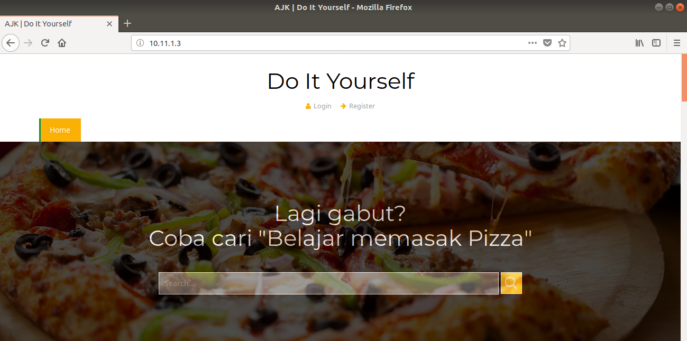

# Ansible

- [Soal](..)
- [How to Run](#how-to-run)
- [Penyelesaian](#penyelesaian)
  - [Playbook](#playbook)
  - [Hosts](#hosts)
  - [Nomor 1](#1)
    - [DB](#db)
    - [Worker 1](#worker-1)
    - [Worker 2](#worker-2)
    - [Provision](#provision)
  - [Nomor 2](#2)
    - [MySQL](#mysql)
    - [my.cnf](#mycnf)
  - [Nomor 3](#3)
    - [Nginx](#nginx)
    - [PHP](#php)
    - [Laravel](#laravel)
  - [Nomor 4](#4)
    - [Clone Project](#clone-project)
    - [Setup Database](#detup-database)
  - [Nomor 5](#5)
    - [hackathon.conf](#hackathonconf)
  - [Test](#test)
  - [Result](#result)

## How to Run

```sh
./hackathon
```

---

## Penyelesaian

### [Playbook](site.yml)

```yaml
- hosts: db
  roles:
    - db

- hosts: workers
  roles:
    - workers

- hosts: 10.11.1.3
  roles:
    - migrate
```

### [Hosts](hosts)

```text
[db]
10.11.1.2 ansible_user=vagrant

[workers]
10.11.1.3 ansible_user=vagrant
10.11.1.4 ansible_user=vagrant
```

### 1

Ketiga vm dibuat menggunakan vagrant.

#### [DB](vms/db/Vagrantfile)

```rb
# -*- mode: ruby -*-
# vi: set ft=ruby :

Vagrant.configure('2') do |config|
  config.vm.box = 'debian/contrib-stretch64'
  config.vm.box_check_update = false
  config.vm.network 'private_network', ip: '10.11.1.2'
  config.vm.synced_folder '~/.ssh', '/home/vagrant/ssh'
  config.vm.provision 'shell', path: '../bootstrap.sh', privileged: false

  config.vm.provider 'virtualbox' do |vb|
    vb.name = 'DB'
    vb.memory = 256
    vb.cpus = 1
  end
end
```

#### [Worker 1](vms/workers/worker1/Vagrantfile)

```rb
# -*- mode: ruby -*-
# vi: set ft=ruby :

Vagrant.configure('2') do |config|
  config.vm.box = 'ubuntu/xenial64'
  config.vm.box_check_update = false
  config.vm.network 'private_network', ip: '10.11.1.3'
  config.vm.synced_folder '~/.ssh', '/home/vagrant/ssh'
  config.vm.provision 'shell', path: '../../bootstrap.sh', privileged: false

  config.vm.provider 'virtualbox' do |vb|
    vb.name = 'Worker 1'
    vb.memory = 256
    vb.cpus = 1
  end
end
```

#### [Worker 2](vms/workers/worker2/Vagrantfile)

```rb
# -*- mode: ruby -*-
# vi: set ft=ruby :

Vagrant.configure('2') do |config|
  config.vm.box = 'ubuntu/xenial64'
  config.vm.box_check_update = false
  config.vm.network 'private_network', ip: '10.11.1.4'
  config.vm.synced_folder '~/.ssh', '/home/vagrant/ssh'
  config.vm.provision 'shell', path: '../../bootstrap.sh', privileged: false

  config.vm.provider 'virtualbox' do |vb|
    vb.name = 'Worker 2'
    vb.memory = 256
    vb.cpus = 1
  end
end
```

#### [Provision](vms/bootstrap.sh)

Setiap vm perlu di-install ansible dan sshpass agar automation dari ansible dapat dijalankan pada vm tersebut.
Setiap vm juga di-copy-kan public key dari host machine tempat vm berada agar bisa ssh tanpa perlu memasukkan password.

```sh
#!/usr/bin/env bash

sudo apt-get -y update
sudo apt-get -y install ansible sshpass

cat /home/vagrant/ssh/id_rsa.pub >> ~/.ssh/authorized_keys
cat ~/.ssh/authorized_keys
```

---

### 2

#### [MySQL](roles/db/tasks/mysql.yml)

```yaml
- name: Install mysql
  become: yes
  apt:
    name: "{{ item }}"
    update_cache: yes
  with_items:
    - mysql-server
    - python-mysqldb

- name: Copy mysql configuration file
  become: yes
  template:
    src: my.cnf
    dest: /etc/mysql/mariadb.conf.d/my.cnf

- name: restart service mysql
  become: yes
  systemd:
    name: mysql
    state: restarted

- name: Create user regal
  become: yes
  mysql_user:
    name: regal
    password: bolaubi
    host: '%'
    priv: '*.*:ALL'

- name: Create database hackathon
  become: yes
  mysql_db:
    name: hackathon
    encoding: utf8mb4
    collation: utf8mb4_unicode_ci
```

#### [my.cnf](roles/db/templates/my.cnf)

Agar koneksi db bisa di-remote, tambahkan config pada mysqld untuk mem-bind address ke `0.0.0.0`. (Step 2 pada task [mysql.yml](#mysqlyml)

```yaml
- name: Copy mysql configuration file
  become: yes
  template:
    src: my.cnf
    dest: /etc/mysql/mariadb.conf.d/my.cnf
```

```text
[mysqld]
bind-address = 0.0.0.0
```

---

### 3

#### [Nginx](roles/workers/tasks/nginx.yml)

```yaml
- name: Install nginx
  become: yes
  apt:
    name: nginx
    update_cache: yes

- name: Remove default nginx configuration file
  become: yes
  file:
    path: /etc/nginx/sites-enabled/default
    state: absent

- name: Copy nginx configuration file
  become: yes
  template:
    src: hackathon.conf
    dest: /etc/nginx/sites-enabled/hackathon.conf

- name: Restart service nginx
  become: yes
  service:
    name: nginx
    state: restarted
```

#### [PHP](roles/workers/tasks/php.yml)

```yaml
- name: Add ppa:ondrej/php for PHP7.2
  become: yes
  apt_repository:
    repo: ppa:ondrej/php

- name: Install required PHP modules
  become: yes
  apt:
    name: "{{ item }}"
    update_cache: yes
  with_items:
    - php7.2
    - php7.2-fpm
    - php7.2-cgi
    - php7.2-common
    - php7.2-mysql
    - php7.2-mbstring
    - php7.2-xml
    - php7.2-zip
    - composer
    - zip
    - unzip

- name: Start service php7.2-fpm
  become: yes
  service:
    name: php7.2-fpm
    state: started
```

#### [Laravel](roles/workers/tasks/laravel.yml)

```yaml
- name: Install git
  become: yes
  apt:
    name: git
    update_cache: yes

- name: Clone project
  become: yes
  git:
    repo: https://github.com/udinIMM/Hackathon
    dest: /var/www/Hackathon

- name: Copy laravel env file
  become: yes
  template:
    src: .env
    dest: /var/www/Hackathon/.env

- name: Change storage/ and bootstrap/cache/ permission
  become: yes
  file:
    path: "{{ item }}"
    mode: 0777
    recurse: yes
  with_items:
    - /var/www/Hackathon/storage
    - /var/www/Hackathon/bootstrap/cache

- name: Install project dependencies
  become: yes
  composer:
    command: install
    working_dir: /var/www/Hackathon

- name: Generate key
  become: yes
  shell: php artisan key:generate
  args:
    chdir: /var/www/Hackathon
```

---

### 4

#### [Clone Project](roles/workers/tasks/laravel.yml)

```yaml
- name: Clone project
  become: yes
  git:
    repo: https://github.com/udinIMM/Hackathon
    dest: /var/www/Hackathon
```

#### Setup Database

##### [laravel.yml](roles/workers/tasks/laravel.yml)

```yaml
- name: Copy laravel env file
  become: yes
  template:
    src: .env
    dest: /var/www/Hackathon/.env
```

##### [.env](roles/workers/templates/.env)

```text
DB_CONNECTION=mysql
DB_HOST=10.11.1.2
DB_PORT=3306
DB_DATABASE=hackathon
DB_USERNAME=regal
DB_PASSWORD=bolaubi
```

##### [migrate](roles/migrate/tasks/migrate.yml)

Migration hanya dilakukan oleh salah satu vm agar tidak melakukan migrate dua kali.

```yaml
- name: Migrate
  become: yes
  shell: php artisan migrate
  args:
    chdir: /var/www/Hackathon
```

---

### 5

#### [nginx.yml](roles/workers/tasks/nginx.yml)

```yaml
- name: Copy nginx configuration file
  become: yes
  template:
    src: hackathon.conf
    dest: /etc/nginx/sites-enabled/hackathon.conf
```

#### [hackathon.conf](roles/workers/templates/hackathon.conf)

```nginx
server {
    listen 80 default_server;
    listen [::]:80 default_server ipv6only=on;

    root /var/www/Hackathon/public;
    index index.php index.html index.htm;

    server_name _;

    location / {
        try_files $uri $uri/ /index.php?$query_string;
    }

    location ~ \.php$ {
        include snippets/fastcgi-php.conf;
        fastcgi_pass unix:/run/php/php7.2-fpm.sock;
    }

    location ~ /\.ht {
        deny all;
    }
}
```

---

## Test

```sh
./hackathon
```

[hackathon](hackathon)

```sh
# boot virtual machines
cd vms
./boot_vms
cd ..

# temporarily disable host key checking
export ANSIBLE_HOST_KEY_CHECKING=False

# test remote hosts
ansible all -i hosts -m ping

# restore host key checking
export ANSIBLE_HOST_KEY_CHECKING=True

# play book
ansible-playbook site.yml -i hosts
```

Keterangan:

Pertama jalankan semua vm dengan menggunakan [boot_vms](vms/boot_vms). Kemudian jalankan task ping ansible untuk menge-tes vm. Variable `ANSIBLE_HOT_KEY_CHECKING` untuk sementara dimatikan untuk melewati prompt ketika pertama kali bertukar public key dengan vm saat ping. Kemudian baru jalankan playbook.

## Result

Lihat pada worker1 10.11.1.3



Lihat pada worker2 10.11.1.4


