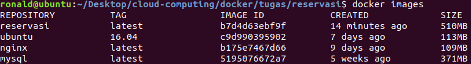

# Docker

- [Soal](..)
- [How to Run](#how-to-run)
- [Penyelesaian](#penyelesaian)
  - [Nomor 1](#1)
    - [Dockerfile](#dockerfile)
    - [server.py](#serverpy)
  - [Nomor 2](#2)
  - [Nomor 3](#3)
    - [balancer.conf](#balancerconf)
  - [Nomor 4](#4)
  - [docker-compose](#final-docker-composeyml)
  - [Test](#test)

## How to Run

```sh
docker build -t reservasi .
docker-compose up -d
```

---

## Penyelesaian

### 1

#### [Dockerfile](Dockerfile)

```Dockerfile
FROM ubuntu:16.04
RUN apt-get update && apt-get -y install python-pip libmysqlclient-dev
RUN pip install --upgrade pip
ENV DB_HOST=192.168.0.24 \
    DB_NAME=reservasi \
    DB_USERNAME=userawan \
    DB_PASSWORD=buayakecil
COPY reservasi /reservasi
WORKDIR /reservasi
RUN pip install -r requirements.txt
ENTRYPOINT ["python"]
CMD ["server.py"]
```

Setiap container nantinya akan memiliki environment variables seperti yang tertera pada Dockerfile untuk konfigurasi db pada app.

Jalankan perintah:

```sh
sudo docker build -t reservasi .
```



---

### 2

Buat 3 buah worker dengan menggunakan image yang dibuat pada soal [1](#1).

```yml
services:
    worker1:
        image: reservasi
    worker2:
        image: reservasi
    worker3:
        image: reservasi
```

---

### 3

Tambahkan service untuk load balancer.

```yml
services:
    balancer:
        image: nginx
        depends_on:
            - worker1
            - worker2
            - worker3
        ports:
            - 5000:80
        volumes:
            - ./balancer.conf:/etc/nginx/conf.d/default.conf
```

Keterangan:

- `depends_on`
  Balancer akan menunggu sampai semua worker sudah berjalan baru balancer dimulai.
- `ports`
  Port mapping dari port 80 container ke port 5000 host
- `volumes`
  Mount file [balancer.conf](balancer.conf) ke directory `/etc/nginx/conf.d` pada container dimana nginx akan meng-include config server.

Tambahkan docker networks pada compose file agar balancer dan workers berada pada satu network.

```yml
networks:
    reservasi:
        ipam:
            config:
                - subnet: 192.168.0.0/24
```

Berikan static IP pada balancer dan workers.

```yml
services:
    worker1:
        networks:
            reservasi:
                ipv4_address: 192.168.0.21
    worker2:
        networks:
            reservasi:
                ipv4_address: 192.168.0.22
    worker3:
        networks:
            reservasi:
                ipv4_address: 192.168.0.23
    balancer:
        networks:
            reservasi:
                ipv4_address: 192.168.0.25
```

#### [balancer.conf](balancer.conf)

```nginx
upstream workers {
    server 192.168.0.21;
    server 192.168.0.22;
    server 192.168.0.23;
}

server {
    listen 80 default_server;
    listen [::]:80 default_server ipv6only=on;

    location / {
        proxy_pass http://workers;
    }
}
```

---

### 4

Tambahkan service untuk database (mysql).

```yml
services:
    db:
        image: mysql
        environment:
            MYSQL_ALLOW_EMPTY_PASSWORD: 'yes'
            MYSQL_DATABASE: reservasi
            MYSQL_USER: userawan
            MYSQL_PASSWORD: buayakecil
        volumes:
            - ./reservasi/reservasi.sql:/docker-entrypoint-initdb.d/reservasi.sql
        networks:
            reservasi:
                ipv4_address: 192.168.0.24
```

Keterangan:

- `volumes`:
  container mysql akan meng-execute semua file sql yg berada pada direktori `/docker-entrypoint-initdb.d` secara berurutan (alphabetically). Sehingga dump database untuk app reservasi diletakkan di direktori tersebut.

Tambahkan dependency workers terhadap db agak db di-load terlebih dahulu sebelum workers.

```yml
services:
    worker1:
        depends_on:
            - db
    worker2:
        depends_on:
            - db
    worker3:
        depends_on:
            - db
```

Tambahkan volumes.

```yml
volumes:
    reservasi:
```

Tambahkan volumes pada node db agar data persistent.

```yml
services:
    db:
        volumes:
            - reservasi:/var/lib/mysql
```

---

### Final [docker-compose.yml](docker-compose.yml)

```yml
version: '3.6'
services:
    worker1:
        container_name: reservasi-worker1
        image: reservasi
        depends_on:
            - db
        networks:
            reservasi:
                ipv4_address: 192.168.0.21
    worker2:
        container_name: reservasi-worker2
        image: reservasi
        depends_on:
            - db
        networks:
            reservasi:
                ipv4_address: 192.168.0.22
    worker3:
        container_name: reservasi-worker3
        image: reservasi
        depends_on:
            - db
        networks:
            reservasi:
                ipv4_address: 192.168.0.23
    db:
        container_name: reservasi-db
        image: mysql
        environment:
            MYSQL_ALLOW_EMPTY_PASSWORD: 'yes'
            MYSQL_DATABASE: reservasi
            MYSQL_USER: userawan
            MYSQL_PASSWORD: buayakecil
        volumes:
            - reservasi:/var/lib/mysql
            - ./reservasi/reservasi.sql:/docker-entrypoint-initdb.d/reservasi.sql
        networks:
            reservasi:
                ipv4_address: 192.168.0.24
    balancer:
        container_name: reservasi-balancer
        image: nginx
        depends_on:
            - worker1
            - worker2
            - worker3
        ports:
            - 5000:80
        volumes:
            - ./balancer.conf:/etc/nginx/conf.d/default.conf
        networks:
            reservasi:
                ipv4_address: 192.168.0.25
volumes:
    reservasi:
networks:
    reservasi:
        ipam:
            config:
                - subnet: 192.168.0.0/24
```

### Test

Jalankan perintah:

```sh
docker-compose up -d
```

Buka `localhost:5000` pada browser.


