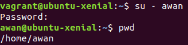

# Vagrant

- Box: [ubuntu/xenial64](https://app.vagrantup.com/ubuntu/boxes/xenial64)
- [Vagrantfile](#vagrantfile)
- [Provision](bootstrap.sh)

### [Vagrantfile](Vagrantfile)
```ruby
# -*- mode: ruby -*-
# vi: set ft=ruby :

Vagrant.configure('2') do |config|
  config.vm.box = 'ubuntu/xenial64'
  config.vm.box_check_update = false
  config.vm.network 'forwarded_port', guest: 80, host: 8080
  config.vm.network 'forwarded_port', guest: 3306, host: 6969
  config.vm.network 'forwarded_port', guest: 4000, host: 12000
  config.vm.network 'forwarded_port', guest: 8000, host: 16000
  config.vm.synced_folder 'pelatihan-laravel', '/var/www/web'
  config.vm.provision 'shell', path: 'bootstrap.sh', privileged: false

  config.vm.provider('virtualbox') do |vb|
    vb.memory = 512
    vb.cpus = 1
  end
end
```

### Soal
1. Buat vagrant virtualbox dan buat user 'awan' dengan password 'buayakecil'

    ```sh
    sudo useradd \
        awan \
        -p $(echo buayakecil | openssl passwd -1 -stdin) \
        -d /home/awan -m
    ```
    
    did it work?

    

2. Buat vagrant virtualbox dan lakukan provisioning install Phoenix Web Framework

	Beberapa packages memerlukan config locale menggunakan UTF-8. Hal itu bisa dilakukan dengan:

	```sh
	locale-gen en_US.UTF-8
	sudo dpkg-reconfigure locales
	```
	
	Phoenix Web Framework ditulis menggunakan bahasa Elixir. Maka harus menginstall Elixir terlebih dahulu:

	```sh
	wget https://packages.erlang-solutions.com/erlang-solutions_1.0_all.deb
	sudo dpkg -i erlang-solutions_1.0_all.deb
	sudo apt-get update
	sudo apt-get -y -f install esl-erlang elixir
	mix local.hex --force
	rm erlang-solutions_1.0_all.deb
	```

	Untuk package dependencies Phoenix menggunakan npm
	```sh
	wget https://nodejs.org/dist/v8.10.0/node-v8.10.0-linux-x64.tar.xz
	tar xf node-v8.10.0-linux-x64.tar.xz
	sudo mkdir /usr/local/lib/nodejs
	sudo mv node-v8.10.0-linux-x64 /usr/local/lib/nodejs/node-v8.10.0
	rm -r node-v8.10.0-linux-x64.tar.xz
	export NODE_HOME=/usr/local/lib/nodejs/node-v8.10.0
	export PATH=$NODE_HOME/bin:$PATH
	. ~/.profile
	```

	Install Phoenix Web Framework
	```
	mix archive.install --force https://github.com/phoenixframework/archives/raw/master/phx_new.ez
	```

	### Test Phoenix Web Framework
	Buat project baru
	```sh
	mix phx.new /home/vagrant/hello
	```

    Install assets dan dependencies
	```sh
	cd hello
	mix deps.get
	cd hello/assets
	npm install
	node node_modules/brunch/bin/brunch build
	```

	Setup database
	```sh
	cd ..
	sudo apt-get -y -f install postgresql postgresql-contrib
	sudo -u postgres psql -c "ALTER USER postgres PASSWORD 'postgres';"
	sudo -u postgres psql -c "CREATE DATABASE hello_dev;"
	sudo service postgresql restart
	mix local.rebar --force
	mix ecto.create
	```

	Run server
	```sh
	mix phx.server
	```
	

	Pada vagrantfile sudah diset port forward dari 4000 guest ke 12000 host
	```ruby
	config.vm.network 'forwarded_port', guest: 4000, host: 12000
	```

	Hasil
	

3. Buat vagrant virtualbox dan lakukan provisioning install: php, mysql, composer, nginx

    Install PHP (+ekstensi untuk Laravel)
	```sh
	sudo apt-get -y -f install python-software-properties software-properties-common
	sudo apt-add-repository -y ppa:ondrej/php
	sudo apt-get update
	sudo apt-get -y -f install php7.2
	sudo apt-get -y -f install php7.2-fpm php7.2-cgi
	sudo apt-get -y -f install php7.2-mysql php7.2-mbstring php7.2-tokenizer php7.2-xml php7.2-ctype php7.2-json
	sudo apt-get -y -f install zip unzip
	```

	Install mysql. Karena pada saat install mysql akan meminta password, bisa diakali dengan menggunakan cara berikut
	```sh
	sudo debconf-set-selections <<< "mysql-server mysql-server/root_password password \"''\""
	sudo debconf-set-selections <<<  "mysql-server mysql-server/root_password_again password \"''\""
	sudo apt-get install -y -f mysql-server
	mysql_install_db
	```

	Install Composer (+Laravel)
	```sh
	curl 'https://getcomposer.org/installer' | php
	sudo mv composer.phar /usr/local/bin/composer
	composer global require "laravel/installer"
	```

	Install nginx
	```sh
	sudo apt-get -y --purge apache2
	sudo apt-get -y -f install nginx
    ```

	[Configurasi server nginx](pelatihan-laravel.conf)
	```
	server {
		listen 80 default_server;
		listen [::]:80 default_server ipv6only=on;

		root /var/www/web/public;
		index index.php index.html index.htm;

		server_name _;

		location / {
			try_files $uri $uri/ /index.php?$query_string;
		}
		
		location ~ \.php$ {
			include snippets/fastcgi-php.conf;
			fastcgi_pass unix:/run/php/php7.2-fpm.sock;
		}

		location ~ /\.ht {
			deny all;
		}
	}
	```

	File konfigurasi di atas berada pada folder ini (tempat Vagrantfile) kemudian di link ke folder `/etc/nginx/sites-enabled` pada guest. Konfigurasi default diunlink terlebih dahulu dari enabled site
	```sh
	sudo rm -f /etc/nginx/sites-enabled/*
	sudo ln -s /vagrant/pelatihan-laravel.conf /etc/nginx/sites-enabled
	sudo nginx -t
	sudo service nginx start
	sudo service php7.2-fpm start
	```

	Setup project. Install dependencies, generate key, set folder permission
	```sh
	cd /var/www/web
	cp .env.example .env
	composer install
	php artisan key:generate
	sudo chmod 777 storage bootstrap/cache
	```

4. Buat vagrant virtualbox dan lakukan provisioning install: squid-proxy, bind9
Buka file bootsrap.sh, lalu tambahkan:
	```sh
	# install squid-proxy
	sudo apt-get install -y -f squid

	# install bind9
	sudo apt-get install -y -f bind9
	```
