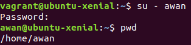
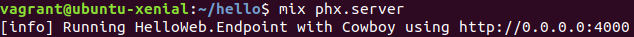
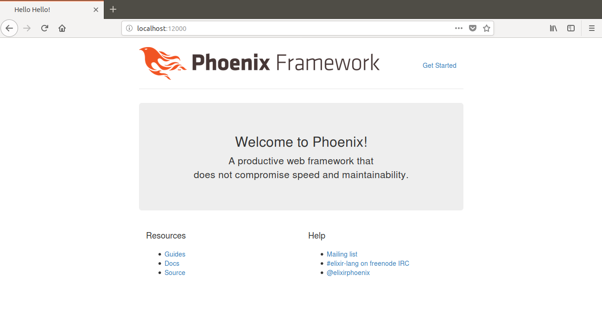
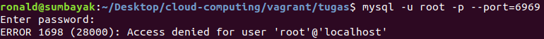
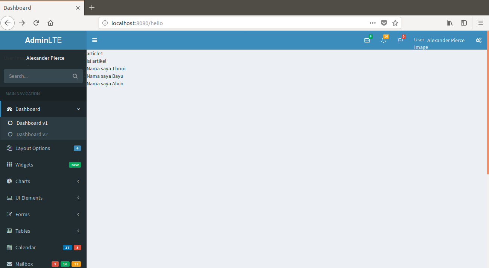

# Vagrant

- Box: [ubuntu/xenial64](https://app.vagrantup.com/ubuntu/boxes/xenial64)
- [Vagrantfile](#vagrantfile)
- [Provision](bootstrap.sh)


### [Vagrantfile](Vagrantfile)
```ruby
# -*- mode: ruby -*-
# vi: set ft=ruby :

Vagrant.configure('2') do |config|
  config.vm.box = 'ubuntu/xenial64'
  config.vm.box_check_update = false
  config.vm.network 'forwarded_port', guest: 80, host: 8080
  config.vm.network 'forwarded_port', guest: 3306, host: 6969
  config.vm.network 'forwarded_port', guest: 4000, host: 12000
  config.vm.network 'forwarded_port', guest: 8000, host: 16000
  config.vm.synced_folder 'pelatihan-laravel', '/var/www/web'
  config.vm.provision 'shell', path: 'bootstrap.sh', privileged: false

  config.vm.provider 'virtualbox' do |vb|
    vb.memory = 512
    vb.cpus = 1
  end
end
```

### Soal

**Note: All features will work in assumes that the provision is completed successfully with no errors and no commands entered directly into guest machine (no ssh required).**

1. Buat vagrant virtualbox dan buat user 'awan' dengan password 'buayakecil'

   Menggunakan command useradd. Opsi -p akan menerima text password yang harus sudah di-hash. Opsi -d menentukan home directory dari user yang akan dibuat (default `/` jika tidak di-set)
   ```sh
   sudo useradd \
       awan \
       -p $(echo buayakecil | openssl passwd -1 -stdin) \
       -d /home/awan -m
   ```
    
   did it work?

   

2. Buat vagrant virtualbox dan lakukan provisioning install Phoenix Web Framework

   Beberapa packages memerlukan config locale menggunakan UTF-8. Hal itu bisa dilakukan dengan:
   ```sh
   export LANG=en_US.UTF-8
   export LANGUAGE=en_US.UTF-8
   export LC_ALL=en_US.UTF-8
   sudo locale-gen en_US.UTF-8
   ```
    
   Phoenix Web Framework ditulis menggunakan bahasa Elixir. Maka harus menginstall Elixir terlebih dahulu:
   ```sh
   wget https://packages.erlang-solutions.com/erlang-solutions_1.0_all.deb
   sudo dpkg -i erlang-solutions_1.0_all.deb
   sudo apt-get update
   sudo apt-get -y install esl-erlang elixir
   mix local.hex --force
   rm erlang-solutions_1.0_all.deb
   ```

   Untuk package dependencies Phoenix menggunakan npm
   ```sh
   wget https://nodejs.org/dist/v8.10.0/node-v8.10.0-linux-x64.tar.xz
   tar xf node-v8.10.0-linux-x64.tar.xz
   sudo mv -T node-v8.10.0-linux-x64 /usr/local/lib/nodejs
   export PATH=$PATH:/usr/local/lib/nodejs/bin
   echo export PATH=$PATH:/usr/local/lib/nodejs/bin >> ~/.bashrc
   rm node-v8.10.0-linux-x64.tar.xz
   ```

   Install Phoenix Web Framework
   ```sh
   mix archive.install --force https://github.com/phoenixframework/archives/raw/master/phx_new.ez
   sudo apt-get -y install inotify-tools
   ```

  Test Phoenix Web Framework
    
   Buat project baru
   ```sh
   echo Y | mix phx.new hello
   ```

   Install assets dan dependencies
   ```sh
   cd hello
   mix local.hex --force
   mix deps.get
   cd assets && npm install && node node_modules/brunch/bin/brunch build
   ```

   Setup database. Secara default phoenix menggunakan database posrtgresql dengan anggapan memiliki user 'postgres' dengan password 'postgres' dan nama database untuk project 'PROJECTNAME_dev'
   ```sh
   cd ..
   sudo apt-get -y install postgresql postgresql-contrib
   sudo -u postgres psql -c "ALTER USER postgres PASSWORD 'postgres';"
   sudo -u postgres psql -c "CREATE DATABASE hello_dev;"
   sudo service postgresql restart
   mix local.rebar --force
   mix ecto.create
   ```

   Run server
   ```sh
   mix phx.server
   ```
   
   

   Pada [Vagrantfile](#vagrantfile) sudah diset port forward dari 4000 guest ke 12000 host
   ```ruby
   config.vm.network 'forwarded_port', guest: 4000, host: 12000
   ```
   
   

3. Buat vagrant virtualbox dan lakukan provisioning install: php, mysql, composer, nginx

   Install PHP (+ekstensi untuk Laravel)
   ```sh
   sudo apt-get -y install python-software-properties software-properties-common
   sudo apt-add-repository -y ppa:ondrej/php
   sudo apt-get update
   sudo apt-get -y install php7.2
   sudo apt-get -y install php7.2-fpm php7.2-cgi
   sudo apt-get -y install php7.2-common php7.2-mysql php7.2-mbstring php7.2-xml
   sudo apt-get -y install zip unzip
   ```

   Install mysql. Karena pada saat install mysql akan meminta password untuk user root, pengisian password root bisa diakali dengan menggunakan cara berikut
   ```sh
   sudo debconf-set-selections <<< "mysql-server mysql-server/root_password password root"
   sudo debconf-set-selections <<< "mysql-server mysql-server/root_password_again password root"
   sudo apt-get install -y mysql-server
   ```

   Karena pada [Vagrantfile](#vagrantfile) port 3306 (port default mysql) guest sudah di-forward ke port 6969 host, maka mysql bisa diakses dari komputer host
   ```ruby
   config.vm.network 'forwarded_port', guest: 3306, host: 6969
   ```
   Namun privilige nya belum diatur sehingga masih gagal dalam login.
   
   

   Install Composer (+Laravel)
   ```sh
   curl 'https://getcomposer.org/installer' | php
   sudo mv composer.phar /usr/local/bin/composer
   composer global require "laravel/installer"
   ```

   Install nginx. Karena secara default apache sudah terinstall pada box ubuntu/xenial64, maka harus dihapus dulu sebelum menginstall nginx
   ```sh
   sudo apt-get -y --purge remove apache2
   sudo apt-get -y install nginx
   ```

   [Configurasi server nginx](pelatihan-laravel.conf)
   ```nginx
   server {
       listen 80 default_server;
       listen [::]:80 default_server ipv6only=on;
       
       root /var/www/web/public;
       index index.php index.html index.htm;

       server_name _;

       location / {
           try_files $uri $uri/ /index.php?$query_string;
       }
        
       location ~ \.php$ {
           include snippets/fastcgi-php.conf;
           fastcgi_pass unix:/run/php/php7.2-fpm.sock;
       }

       location ~ /\.ht {
           deny all;
       }
   }
   ```

   File konfigurasi di atas berada pada folder ini (tempat Vagrantfile) kemudian di link ke folder `/etc/nginx/sites-enabled` pada guest. Konfigurasi `default` di-unlink terlebih dahulu dari enabled site
   ```sh
   sudo rm -f /etc/nginx/sites-enabled/*
   sudo ln -s /vagrant/pelatihan-laravel.conf /etc/nginx/sites-enabled
   sudo nginx -t
   sudo service php7.2-fpm start
   sudo service nginx restart
   ```

   Setup project. Install dependencies and generate key
   ```sh
   cd /var/www/web
   cp .env.example .env
   composer install
   php artisan key:generate
   ```

   Hasil salah satu route
   ```ruby
   config.vm.network 'forwarded_port', guest: 80, host: 8080
   ```
   
   

4. Buat vagrant virtualbox dan lakukan provisioning install: squid-proxy, bind9

   ```sh
   # install squid-proxy
   sudo apt-get -y install squid3

   # install bind9
   sudo apt-get -y install bind9
   ```
